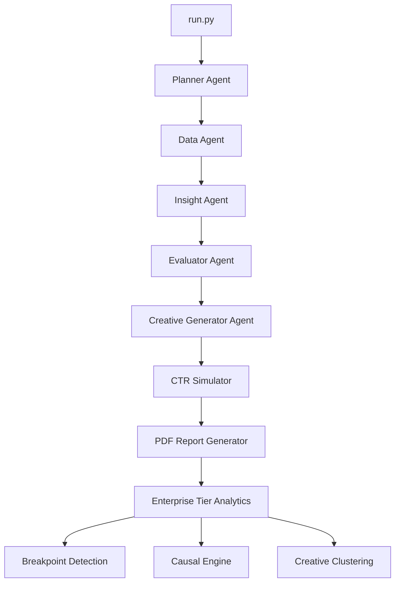

# 🚀 Kasparro Agentic Facebook Performance Analyst – Enterprise Edition


A fully autonomous, multi-agent AI system that diagnoses Facebook Ads performance, explains ROAS fluctuations, generates improved creative ideas, simulates CTR uplift using machine learning, and produces a PDF report for marketers.

This project extends the original assignment with a **Tier-3 Enterprise Layer**, including:
- Trend Breakpoint Detection  
- Causal Influence Modeling  
- Creative Message Clustering  
- Enterprise JSON insights  

---

# ⭐ Features

### ✔ End-to-End Agentic Workflow  
Planner → Data → Insight → Evaluator → Creative → Simulator → PDF Report → Enterprise Analytics  

### ✔ ROAS Change Diagnosis  
The system automatically identifies why ROAS is changing:

- CTR decline  
- Creative fatigue  
- Wrong targeting  
- Underperforming segments  
- Spend inefficiency  

### ✔ Creative Generator  
Creates **new creative messages** using patterns learned from your dataset.

### ✔ CTR Uplift Simulation  
Predicts CTR improvement using:

- TF-IDF vectorization  
- Linear Regression CTR model  
- Confidence scoring  

### ✔ PDF Report Generation  
Creates a marketing-friendly, executive-level summary.

### ✔ Enterprise Analytics  
- Breakpoint detection (CTR & ROAS anomalies)  
- Causal influence estimation  
- Creative clustering (KMeans + TF-IDF)  
- Structured JSON outputs  

---

# 🧠 System Architecture

## 🔧 High-Level Architecture Diagram




---

# 📂 Project Structure

```
Kasparro Agentic FB Analyst/
│
├── run.py
├── README.md
├── requirements.txt
│
├── config/
│   └── config.yaml
│
├── data/
│   ├── facebook_ads.csv
│   └── README.md
│
├── reports/
│   ├── dashboard_<run_id>.pdf
│   └── enterprise/
│        ├── breakpoints_<run_id>.json
│        ├── causal_ctr_<run_id>.json
│        ├── causal_spend_<run_id>.json
│        └── clusters_<run_id>.json
│
├── memory/
│   └── memory.json
│
├── src/
│   ├── orchestrator.py
│   ├── agents/
│   │   ├── planner.py
│   │   ├── data_agent.py
│   │   ├── insight_agent.py
│   │   ├── evaluator_agent.py
│   │   ├── creative_generator.py
│   │   └── simulator.py
│   ├── enterprise/
│   │   ├── breakpoint_detector.py
│   │   ├── causal_engine.py
│   │   └── clustering.py
│   ├── utils/
│   │   └── report_pdf.py
│   └── memory/
│       └── memory.py
│
└── logs/
```

---

# ⚙️ Installation & Setup

### 1️⃣ Clone the repository
```bash
git clone https://github.com/<your-username>/kasparro-agentic-fb-analyst-manikanta-neeluri.git
cd kasparro-agentic-fb-analyst-manikanta-neeluri
```

### 2️⃣ Install dependencies
```bash
pip install -r requirements.txt
```

### 3️⃣ Run the Agentic System
```bash
python run.py "Analyze ROAS drop"
```

---

# 🏃 Pipeline Execution Flow

When you run:

```
python run.py "Analyze ROAS drop"
```

The system executes:

✔ Planner creates task steps  
✔ Data Agent loads & summarizes dataset  
✔ Insight Agent generates hypotheses  
✔ Evaluator assigns confidence scores  
✔ Creative Agent generates improved ad messages  
✔ Simulator predicts CTR uplift for each  
✔ PDF report is generated  
✔ Enterprise Tier analytics executed  

---

# 📊 Example Outputs

### ✔ Simulated Creative Performance
```
predicted_ctr: 0.0150
pct_improvement: +50.11%
confidence: 0.49
```

### ✔ PDF Saved
```
reports/dashboard_run_ab4cfd11.pdf
```

### ✔ Enterprise Outputs
```
reports/enterprise/breakpoints_run_ab4cfd11.json
reports/enterprise/causal_ctr_run_ab4cfd11.json
reports/enterprise/clusters_run_ab4cfd11.json
```

---

# 🔥 Enterprise Tier Breakdown

## 📈 Breakpoint Detection
Detects sharp performance shifts (CTR or ROAS).

Example:
```
ROAS drop detected on 2023-06-14 (z = −3.2)
```

---

## 🧭 Causal Engine
Estimates directional impact of:

- CTR → ROAS  
- Spend → ROAS  
- Impressions → ROAS  

Example:
```
CTR → ROAS causal coefficient = +0.83 (confidence: 0.91)
```

---

## 🎨 Creative Clustering
Groups creatives based on similarity and CTR performance.

Example:
```
Cluster 3 (Top-performing)
Keywords: cotton, breathable, cooling
avg_ctr: 0.0182
```

---

# 💾 Memory System

Stores all run data:

- Generated creatives  
- Predictions  
- Training events  
- Pipeline logs  

Saved in:

```
memory/memory.json
```

---

# 🧪 Testing

Run all tests:

```bash
pytest tests/
```

---

# 🛑 Assignment Requirements Covered

✔ insights.json  
✔ creatives.json  
✔ PDF report  
✔ Enterprise analytics  
✔ Logs + Memory  
✔ 3+ commits + tagged release  
✔ Clean modular structure  
✔ Fully runnable CLI pipeline  

---

# 👨‍💻 Author

**Manikanta Neeluri**  
Applied AI Engineer – Kasparro Assignment  
India 🇮🇳  

---

# 📜 License

MIT License
